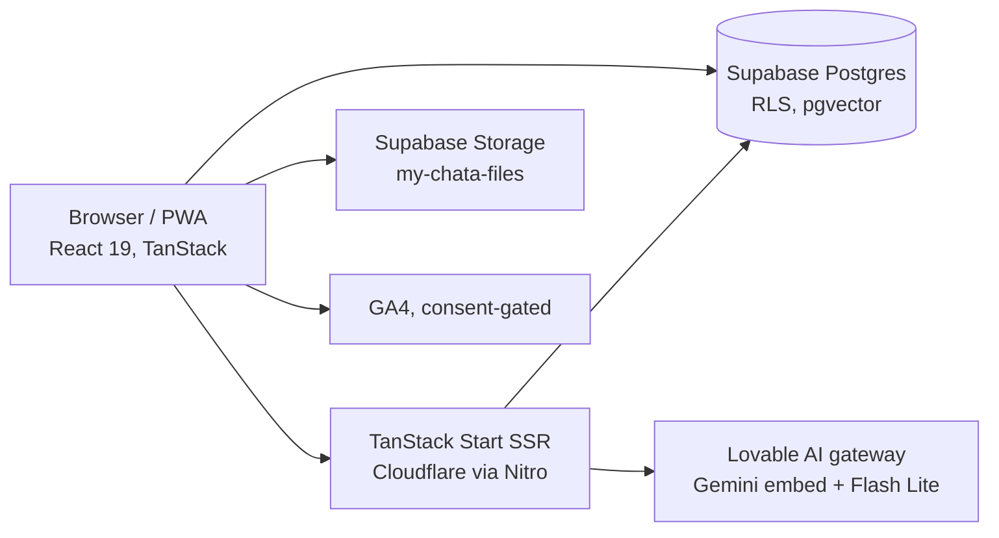

# Architecture today

- The browser talks to Supabase directly with the user's session; row-level security is the access control. Server functions (`src/lib/*.functions.ts`) exist where a secret is needed (AI key) or input must be checked first.
- Hosting, the Google sign-in broker and the AI key come from Lovable Cloud today (`environments.md`).
- Offline: TanStack Query cache persisted to localStorage for 7 days (`src/routes/__root.tsx`), cleared on sign-out.

| Topic                                              | File                      |
| -------------------------------------------------- | ------------------------- |
| Accounts, roles, what anonymous visitors can reach | `tenancy-and-security.md` |
| House manual search                                | `rag.md`                  |
| Plans, limits, payments                            | `billing.md`              |
| Hosting, env vars, lockfile, local dev             | `environments.md`         |
| Every table, policy and function                   | `../generated/schema.md`  |
