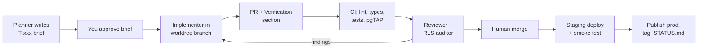

> Copy of the Claude doc "MyChata MVP: critical review and V3 build system". The doc is the working copy; Claude refreshes this file whenever it edits the doc.

# MyChata MVP: critical review and V3 build system

Sep 25, 2026 · @Tuik

MyChata has a real, well-scoped V1 for family cottage co-management. But the repo docs describe it as more finished and safer than the code is, and the build system around it (Lovable pushing straight to production, one database, no tests, three competing sources of truth) can't safely absorb subscriptions, a marketplace or parallel agents yet. Reviewed: the local `MyChata MVP` folder, all 11 migrations, every server function, the live mychata.cz home page and the iOS bug screenshot.

## Progress checklist (updated 26 Sep, 14:00)

The security fixes are live. On 25 Sep Lovable applied migrations 0011–0015 to the production database with no data lost, and mychata.cz now runs the new build. None of the fixes have been checked in a browser yet, and the automated checks on `main` have failed since Lovable's last commit. A fix for that is ready. The rest of the original action list is still open.

### Done

- [x] Critical review written (sections below)
- [x] Fixes built and tested on a branch: 35 automated tests pass and the app builds
- [x] Branch pushed, PR #1 merged, checks passed on the merge (action 1)
- [x] Lovable Knowledge rules pasted (action 3)
- [x] `main` protected against force pushes and deletion; secret scanning and Dependabot on (action 4)
- [x] Lovable switched back from `lovable/experiments` to `main`
- [x] Migrations 0011–0015 applied to the live database. Lovable added an empty 0016 to trigger them, so they ran as one batch. Counts are unchanged: 8 members, 4 profiles, 3 chatas. Also confirmed independently: the database types Lovable regenerated on GitHub contain the new functions and no longer contain the old leaky ones.
- [x] Live site runs the new build. Checked 18:00: a wrong institution form link shows "Tento odkaz na formulář neplatí", and the home page no longer links to the demo university's form.
- [x] Defects 1–13 in "Fix first" are fixed in the live database. So far this is proven only by automated tests and Lovable's security scan. The scan flags one item: anyone can read the feature switches. That's intended; they're on/off flags, not data.

### Do next (in this order)

**Urgent (20:30): the live site is down for every visitor.** It shows "This page didn't load". The 17:52 publish built the browser code without the public Supabase address and key. Those values lived in a committed `.env` until Lovable removed it from git this morning. Switching Lovable's branch and back then rebuilt its workspace from GitHub, where the file no longer existed. Details are in `docs/bugs/B-002`.

- [x] **Merge `agent/claude/fix-build-env`, then publish from Lovable.** The branch puts the public values back in a committed `.env.production` (no secrets) and adds a check that fails CI if the browser code is ever built without them again. I tested both cases. Open mychata.cz afterwards with the browser console open.
- [x] **Download a full backup now** in Lovable: Cloud → Advanced settings → Export data. Store it outside Lovable. Ask whether the export includes sign-in accounts and uploaded files.

**Update 26 Sep, 01:00.** The site is back up. The sign-in page loads, and the browser code now contains the Supabase settings. The backup is a complete database copy: all 30 app tables plus sign-in accounts. It does not include uploaded photos and documents. The first five checks found a real bug (B-003), now fixed on a branch.

- [x] **Merge `agent/claude/onboarding-fixes`, then ask Lovable to apply migration 0017 and publish.** People linked to an existing account now skip onboarding. Non-admins who add a chata get their own account instead of a 403. A new preview image replaces the error-page screenshot in WhatsApp previews. A nightly GitHub check opens mychata.cz in a real browser. 38 tests pass.
- [ ] **Redo the five checks** after that publish.
- [ ] **Monthly backup routine** (`docs/runbooks/backup.md`): export, keep the last 3, store encrypted outside the repo. Ask Lovable once a quarter for a copy of the uploaded files.
- [ ] **Google sign-in on Brave (B-004).** It fails in Lovable's sign-in broker, not our code. Email login works meanwhile. Ask Lovable whether you can use your own Google sign-in credentials.
- [ ] **Demo family contains a real Gmail member.** Decide with T-012 (demo data removal).

**Update 26 Sep, 03:00.** PR #5 was merged and 0017 is live; the checks on `main` pass and the new preview image is served. To trigger its migrator, Lovable added `0018`, an exact copy of 0017. Running it twice is harmless because the migration only replaces a function and fills in a date that's already set. Leave both files in place: applied migrations are never deleted.

- [ ] **Five checks on the live site**, then tag the release
- [x] **Delete the four memory entries** Lovable listed (Settings → Knowledge → Memory)
- [x] **Cleanup PR** (duplicates from Lovable's review, 0018 note, release rule) → Claude, not Lovable. Done: PR #6, merged 03:25
- [ ] **T-014, T-015, T-016** (performance, missing tests) → Claude via PRs
- [ ] **Lovable's next job: UI and UX only** (see the prompt in chat)

**Update 26 Sep, 05:30.** The cleanup is merged and main is green, but nothing is released yet: the five checks and the release tag are still the next step.

- **PR #6 merged at 03:25**, CI green on main. It adds the full release checklist (docs/runbooks/release.md), saves the design rules Lovable dropped from its memory into docs/product/design.md, adds Knowledge rules 3a (a trigger migration must be empty, never a copy) and 9 (no project rules in Lovable's memory), and deletes the duplicate build log and roadmap.md.
- **GitHub branches cleaned up.** Only main and one Dependabot branch remain.
- **Live site loads** (checked 05:25). Production is still 2905bc4 with no release tag.
- **Nightly production check has not run yet.** Nothing had appeared on GitHub by 05:20; scheduled jobs often start late. Look under Actions later this morning.
- **Your Mac copy is on the deleted cleanup branch.** Run `git checkout main && git pull` in the mychata folder.
- **New: Dependabot PR #2** (actions/checkout 4 → 7). Merge it after the release tag, once its CI passes.

**Update 26 Sep, 13:30.** The live security fixes hold when probed as an anonymous visitor, and a guardrails branch for two maintainers is ready on your Mac. The Gemini review is now a set of prompts, one batch per agent: [MyChata: agent prompts from the 26 Sep review](https://claude.ai/code/artifact/7b07f9c1-14fd-4777-8538-cd684a70538e).

- **Live database, anonymous and read-only.** The four removed functions are gone (404). Chatas, members, bookings, expenses, tasks and manual sections all refuse access (401). The link functions return nothing for a wrong token. Only the on/off feature switches are readable, as intended.
- **Nightly production check** first ran at 10:33, five hours late (normal for GitHub's scheduler), and passed.
- **New finding: two security headers missing on mychata.cz** (Content-Security-Policy, X-Frame-Options), so another site could embed the app in a frame. Lovable's hosting sets the headers. Ask Lovable whether custom headers are possible; otherwise fix with Model B.
- **Guardrails branch `agent/claude/two-person-guardrails`** (on your Mac, not pushed; I have no push access). It adds a CI step that fails on duplicate migration numbers, journal gaps and edits to applied migrations, plus docs/runbooks/two-person-workflow.md. Publish the branch from VS Code, open a PR, merge.
- **Bots.** Lovable made 125 of the repo's 146 commits: 93 are titled "Changes" and 26 contain no changes. Since its Knowledge rules went in (25 Sep) it made 9 commits. One edited a server function, against the rules, and broke CI (4f08864, fixed in PR #3). Dependabot's weekly package updates fail every time because of Lovable's private package links, so they add nothing. Its GitHub Actions update (PR #2) is useful. CI caught one real failure and guards against a repeat of B-002.
- **The "strangers in my cottage" findings in the Gemini review are the demo family** (Chata U Lípý, Petra Nováková). Your account is linked to it. That makes T-012 urgent before anyone else reviews the app.

* [x] **Turn the checks on `main` green again.** Done: merged as PR #3, and the checks were green again at 18:16.
* [ ] **Five checks on the live site** (T-001 step 5). They need a signed-in account:
  - [ ] Sign in
  - [ ] Make someone admin, then back
  - [ ] Ask the manual a question
  - [ ] Copy the public calendar link in Kalendář and open it in a private window
  - [ ] Create a guest link in Více and send a request from a private window
* [ ] **Tell members the links changed.** Old public calendar and manual links and printed QR codes no longer work. Re-share them from Kalendář and Manuál. Institutions share their own request form link from Více.
* [ ] **Tag the release** after the checks pass (`docs/runbooks/release.md` step 4), then fill in the Production row in `docs/STATUS.md`.
* [ ] **Decide public or private.** The repo has been public since it was created. With the fixes live, it's much less urgent. Still, public means anyone can read the code, the architecture docs and the list of past defects. Choose deliberately; this also ties to the AGPL licence question.
* [x] **Clean up branches** on GitHub. Delete `lovable/experiments`, `agent/claude/foundation-2026-09-25` and `agent/claude/ci-ignore-generated-types`. Keep `agent/claude/fix-build-env` until it is merged, then delete it too.
* [x] **GitHub file pages showing 500.** This comes from GitHub's side (the code, pull requests and checks all work). If it still happens, contact GitHub Support.

### Still open from the action list

- [ ] 5\. Confirm you can export the full database and hold the admin key
- [ ] 6\. Check "Confirm email" is on
- [ ] 7\. Demo family and fake university still in the live database (script ready; your decision)
- [ ] 8\. Staging database (T-003)
- [ ] 9\. Email provider (T-005) and error monitoring (T-006)
- [ ] 10\. Legal basics: operator identity, terms, company, trademark, licence, AI data processing
- [ ] 11\. Notion: archive or reference only
- [ ] 12\. Talk to 10 families and 3 institutions; write 40 test questions for the manual (T-008)
- [ ] 13\. Later work in order: T-004 signed-in tests → T-002 own hosting → T-009 billing → T-010/T-011 direct bookings and calendar sync
- [ ] 14\. Local: open the `mychata` folder in VS Code; `git stash drop` once you're happy
- [ ] Low priority: Dependabot's weekly package check fails, most likely because of Lovable's private package links in `bun.lock`

Full details: `mychata/docs/STATUS.md` and `mychata/docs/tasks/`

.

## Fix first: defects found in the code

These came from reading the migrations and server functions, not from the docs. Several contradict items marked ✅ in `docs/00-OVERVIEW.md` and `docs/build-last-3-responses.md`. Paths are relative to `my-chata-manager_LovableCodebaseDownload/`. Nothing below was tested against the live database; each has a one-line check.

**Status 25 Sep, 18:00:** all 12 are fixed. The database fixes are live and #12 was fixed on your Mac. They're not yet checked in a browser; see the progress checklist above.

| #   | Defect                                                                                                                                                                                                                                                                                                             | Where                                                                                                          | Severity                          | Fix                                                                                                                                                                      |
| --- | ------------------------------------------------------------------------------------------------------------------------------------------------------------------------------------------------------------------------------------------------------------------------------------------------------------------ | -------------------------------------------------------------------------------------------------------------- | --------------------------------- | ------------------------------------------------------------------------------------------------------------------------------------------------------------------------ |
| 1   | Any signed-in user can read any other property's manual chunks, including members-only sections. `match_manual_chunks` is SECURITY DEFINER, granted to all authenticated users, takes any `_property_id` and any `_count`. Latent today only because of #2; fixing RAG switches the leak on.                       | `drizzle/migrations/0007_*.sql`, `src/lib/manual-qa.functions.ts`                                              | Critical                          | Add an account check inside the function (`property_id in (select id from properties where account_id = current_account_id())`), cap `_count` at 8, filter by visibility |
| 2   | RAG Stage 1 has almost certainly never stored an embedding. The insert writes a `lang` column that doesn't exist in `manual_chunks`, `gemini-embedding-001` returns 3,072 dims against `vector(768)`, and insert errors are never checked. Q&A silently falls back to pasting the first 6 sections into the model. | `src/lib/manual-qa.functions.ts`, `src/integrations/supabase/types.ts`                                         | High                              | Check: `select count(*) from manual_chunks;` Then add `lang`, set `output_dimensionality: 768` (or migrate the column), throw on insert error                            |
| 3   | Every PUBLIC manual section of every property can be listed by anyone holding the publishable key, which ships in every page. New sections default to `PUBLIC`; onboarding writes house rules as `PUBLIC`. Wi-Fi codes and key-box instructions are the kind of thing admins put there.                            | `0001_*.sql`, `0008_*.sql`, `src/routes/verejne.manual.$propertyId.tsx`                                        | High                              | Default to members-only. Serve the public manual through a definer function keyed by an unguessable share token, not the property id                                     |
| 4   | A property id alone gets a stranger the address plus every booked date, which also tells them when the cottage is empty.                                                                                                                                                                                           | `public_property_details`, `public_booking_availability` (`0005`, `0006`)                                      | High                              | Same token pattern as #3; public availability only for properties that opt in                                                                                            |
| 5   | Make/remove admin always fails. `clenove.tsx` writes `user_roles` from the browser, but users only have SELECT on it. The last-admin check counts `members.role`, while access checks `user_roles`: two role systems that drift.                                                                                   | `src/routes/clenove.tsx`, `0003_*.sql`                                                                         | High                              | One definer function `set_member_role(member_id, role)`, one role store, scoped per account                                                                              |
| 6   | Guest booking submissions very likely fail. `submitGuestRequest` inserts with the anon key; `guest_requests` has no anon INSERT grant or policy.                                                                                                                                                                   | `src/lib/guest.functions.ts`, `0007_*.sql`                                                                     | High                              | Check by submitting one test request. Replace with a definer function `submit_guest_request(token, …)` plus a rate limit                                                 |
| 7   | A user can belong to only one account, ever. `members.user_id` is UNIQUE, `current_account_id()` uses `LIMIT 1`, admin is a global role. Inviting someone who already has an account silently returns null.                                                                                                        | `0003_*.sql`, `0007_*.sql` (`accept_invitation`)                                                               | High (blocks institutional plans) | See section 2: a memberships table and an explicit active account                                                                                                        |
| 8   | The public stay-request form linked from the mychata.cz home page is hard-wired to the first institutional property, which is the seeded demo "Vysoká škola podhorní". Real visitors can file requests into a fake university. Seed families with `example.cz` emails also live in production.                     | `public_institutional_property()`, `supabase/migrations/20260908133152_*.sql`, `src/routes/verejne.zadost.tsx` | Medium                            | Remove seed data from production; one public request page per institution via slug                                                                                       |
| 9   | Any member can edit or delete every booking, task, expense, split and handover in the account. "Only the receiver confirms a settlement" is enforced only in the UI.                                                                                                                                               | `FOR ALL` policies in `0003_*.sql`, `src/routes/vydaje.vyrovnani.tsx`                                          | Medium (money)                    | Per-row policies: author or admin edits; only the receiving member can set `paid_back`                                                                                   |
| 10  | Admin-only documents: the row is protected, the file is not. Storage policies check only the property folder.                                                                                                                                                                                                      | `0004_*.sql`                                                                                                   | Medium                            | Store admin-only files under a separate prefix with an admin check                                                                                                       |
| 11  | No rate limit on `askManual` or `translateTaskText`; anon can insert unlimited `manual_feedback` rows.                                                                                                                                                                                                             | `src/lib/*.functions.ts`, `0001_*.sql`                                                                         | Medium (cost)                     | Per-user daily cap in a small `usage_counters` table                                                                                                                     |
| 12  | Local copy is not runnable as is. `VITE_SUPABASE_PUBLISHABLE_KEY` starts with `ssb_` (typo) in both `.env.local` files; 60 files carry an uncommitted Prettier reformat; a stray `package-lock.json` sits in a Bun project.                                                                                        | both `.env.local`, `git status`                                                                                | Low but blocking                  | Fix the key; commit the reformat alone or discard it; delete `package-lock.json`                                                                                         |

Two more to verify rather than assume. First, `claim_initial_membership` links a new user to any unclaimed member whose email matches, so make sure "Confirm email" is on for password sign-ups, or someone could claim a relative's seat. Second, the iOS screenshot in `Screenshots/Bugs/` still shows the Language card the repo has already removed, so the live site is running an older build than `main`. Nothing records which commit is live.

## 1. The ecosystem today

The product is sound; the system around it is not yet a business system. The code is small (about 7,000 lines outside the UI kit), which makes now the cheapest moment to fix the foundations.

**What is genuinely good.** Family and institutional modes are cleanly separated. Tasks store both languages instead of translating on render. Consent Mode v2 is set before the tag loads. Public data goes through definer functions, which is the right pattern even where the functions are too open. The migrations show security tightening over time (open policies in `0000`, scoped by `0004`).

| Layer             | Today                                                                                                                                                                                                                               | Problem                                                                                                                                                                                                                                                                                                                          |
| ----------------- | ----------------------------------------------------------------------------------------------------------------------------------------------------------------------------------------------------------------------------------- | -------------------------------------------------------------------------------------------------------------------------------------------------------------------------------------------------------------------------------------------------------------------------------------------------------------------------------- |
| Source of truth   | Four places: Notion PRD and Build Log (named in `.lovable/plan/*.md`), the repo (`AGENTS.md`, `roadmap.md`, `.lovable/plan/`, `docs/build-last-3-responses.md`), the workspace `docs/00–09` outside git, and Lovable's chat history | They disagree. `docs/01` plans a Next.js move although TanStack Start already does SSR; `docs/06` specifies OpenAI 1,536-dim embeddings while the code uses Gemini at 768; `docs/07` CI uses npm on a Bun project; `docs/02` puts V2 in Q2–Q3 2026, already past. The workspace docs aren't versioned and Lovable can't see them |
| Build and deploy  | Lovable edits `main` directly (116 of 119 commits are the bot, most titled "Changes") and publishes to production                                                                                                                   | Production is whatever Lovable last published, not what's on `main`. No PR, no CI, no tag of what's live                                                                                                                                                                                                                         |
| Database          | One Supabase project (`envsfjjefkievkwqbrby`) managed by Lovable Cloud; migrations split across `drizzle/migrations` (11) and `supabase/migrations` (2)                                                                             | No staging database, so every agent migration runs on real family data. `.env.example` tells you to copy the key from the browser's network tab and the service-role key is blank, which suggests you don't hold admin credentials to your own database                                                                          |
| Vendor coupling   | Lovable owns the Vite wrapper, Google OAuth broker (`@lovable.dev/cloud-auth-js`), AI gateway key, error reporting and hosting                                                                                                      | Five separate exits to plan, not one. The data exit is the one that matters                                                                                                                                                                                                                                                      |
| Business plumbing | Privacy page and consent log exist                                                                                                                                                                                                  | No operator identity, terms, or contact on mychata.cz; no email provider (invites are copy-paste links); no billing; no support channel                                                                                                                                                                                          |
| Evidence          | Docs mark V1 "✅ shipped"                                                                                                                                                                                                           | The build log was verified by the same agent that built it. Defects 1–6 above sit inside ✅ items                                                                                                                                                                                                                                |

**Recommendation.** Before any V2 work: (1) confirm you can take a full `pg_dump` and hold the service-role key, (2) collapse to one source of truth inside the repo, (3) put a human-merged PR plus CI between every agent and production. Sections 4–6 give the exact setup.

## 2. Structure for subscriptions, including institutional

The billing unit must be the account, and a person must be able to sit in several accounts. Today neither is true (defect 7), so tiers can't be built on the current schema without a data migration. Do it now while there are few real rows.

**Schema changes, in order**

| Change                                                                                                                                              | Why                                                                                                                                                   |
| --------------------------------------------------------------------------------------------------------------------------------------------------- | ----------------------------------------------------------------------------------------------------------------------------------------------------- |
| `memberships(user_id, account_id, role, status)`, drop the UNIQUE on `members.user_id`                                                              | One person in their family's chata, their in-laws' chata and their employer's institution. `members` stays as "people", some without logins (grandma) |
| `profiles.active_account_id` + `is_member(account_id)` / `has_account_role(account_id, role)` helpers                                               | Replaces `current_account_id() … LIMIT 1` and the global `user_roles.admin`                                                                           |
| `account_id` copied onto `bookings`, `tasks`, `expenses`, `handovers`, `documents`                                                                  | Every policy and every usage count becomes one indexed check instead of a join through `properties`                                                   |
| `plans`, `subscriptions(account_id, plan_id, status, seats, current_period_end, provider_ref)`, `billing_events(provider_event_id UNIQUE, payload)` | Webhooks arrive twice; the unique id makes them idempotent                                                                                            |
| `entitlements` view + `has_entitlement(account_id, feature)` used inside definer functions                                                          | Limits (chatas, storage, AI questions, guest links) enforced in the database, not only hidden in the UI                                               |
| `audit_log(account_id, actor, action, target, at)`                                                                                                  | Institutions will ask who approved which stay. It is also the base of "compliance reports"                                                            |
| Staging project + seed script                                                                                                                       | Billing and tenancy migrations must never be tried first on production                                                                                |

**Institutional reality in Czechia.** Universities, municipalities, trade unions and companies with recreation facilities often pay against an invoice, sometimes through procurement, not by card. Several run employee recreation through the social fund (FKSP) or a union budget. So the institutional plan needs annual invoicing with IČO/DIČ, bank transfer with a QR payment code, a named contract owner, and data-processing terms. Card checkout alone won't close these.

**Payments stack.** Keep SaaS billing and marketplace payments separate. For subscriptions, Stripe Billing with Stripe Tax works, or a merchant-of-record service that takes over EU VAT for B2C, worth weighing for a small team. Marketplace money (guest pays, host receives) is a regulated payment flow and belongs in Stripe Connect or a Czech gateway's equivalent, and only in V2.

**Pricing critique (`docs/03-BUSINESS.md`).** The Free tier drops expense tracking, which is the core family feature and the reason relatives join. Families are also your distribution: every invited cousin is a user. A stronger split:

| Tier          | Who                                    | Charge for                                                                                                      |
| ------------- | -------------------------------------- | --------------------------------------------------------------------------------------------------------------- |
| Family (free) | One family, 1–2 chatas                 | Nothing; generous limits                                                                                        |
| Family Plus   | Families who rent out spare weeks      | Guest links, direct booking, calendar sync, guest registration and tourist-fee reports, more storage, AI manual |
| Institution   | Universities, unions, companies, clubs | Per property per year: request queue, eligibility rules, audit log, CSV/ISDOC export, SSO later                 |

Commission rates tied to plans (12%/8%/5%) should wait until a marketplace exists; putting them in the tier table now anchors a price you can't yet defend.

## 3. Taking share from Airbnb, Booking.com and Couchsurfing by V3

A head-on marketplace won't take meaningful share by V3. Marketplaces win on guest demand, and Booking and Airbnb buy that demand at a scale MyChata can't match. The winnable route is to own the host's side of the chata (its calendar, money, paperwork and history), then send idle weeks to direct bookings, and only then aggregate demand. Airbnb and Booking are built for strangers renting to strangers; MyChata's ground is the chata that is mostly used by its own people.

**Facts that change the plan**

- Czechs make roughly 8 million stays a year in their own holiday homes ([Česko v datech, Eurostat 2018](https://www.ceskovdatech.cz/clanek/155-chaty-a-chalupy/)). That non-commercial use is the biggest segment and nobody serves it. The "500,000+ properties", "Airbnb \~8,000 CZ cabins" and "17% average commission" figures in `docs/00` and `docs/04` have no source; cite or drop them.
- Airbnb has moved most hosts to a single host-only fee of about 15.5% since October 2025 ([Hostaway](https://www.hostaway.com/blog/airbnb-host-only-fee-what-to-know-about-the-15-percent-host-fee/)). Undercutting commission is a thin wedge; a 0% direct booking the owner controls is a thicker one.
- EU Regulation 2024/1028 applies from 20 May 2026: short-term rentals need a registration number where member states require it, and platforms must collect and share host data ([EUR-Lex summary](https://eur-lex.europa.eu/EN/legal-content/summary/online-short-term-accommodation-rental-services-data-collection-and-sharing.html)). Czechia's eTurista register missed its 1 July 2026 launch and is being reworked; guest book, Ubyport reporting of foreign guests and the local tourist fee still apply ([Hostivio](https://hostivio.cz/en/eturista/)). Paperwork is real pain for small hosts, and a wedge.

**The V2 to V3 path**

| Stage | Move                                                                                                                                                  | Why it beats the incumbents                                                                           | Proof metric                                                    |
| ----- | ----------------------------------------------------------------------------------------------------------------------------------------------------- | ----------------------------------------------------------------------------------------------------- | --------------------------------------------------------------- |
| V1.5  | Win families and institutions: calendar, expenses, handover, manual, vault                                                                            | Airbnb and Booking have nothing for co-owners. History (repairs, costs, manuals) is switching cost    | Weekly active chatas; chatas with 3+ active members             |
| V2    | Idle weeks become direct bookings: guest links, friends-of-family pricing, deposit, guest registration, tourist-fee report, registration-number field | Owner keeps 100%; compliance done in the same app                                                     | Share of chatas with a live guest link; direct nights per chata |
| V2    | Two-way iCal with Airbnb and Booking; later a channel-manager partner                                                                                 | MyChata becomes the system of record instead of a rival listing                                       | Chatas syncing at least one external calendar                   |
| V2.5  | Chata swap: owners trade weeks with other owners using points, the HomeExchange model, among verified owners                                          | This is what Couchsurfing's community promised, with trust built on real ownership and known families | Swap nights per month                                           |
| V3    | Public discovery for opted-in chatas only, region by region; AI search once a region has enough supply                                                | Launching demand before supply density loses to Booking's SEO                                         | Bookable chatas per region; search-to-request rate              |

**Cut from the V3 roadmap until supply exists:** native app (a PWA plus email and SMS reaches 45–68-year-olds better), microservices and API gateway, Next.js migration, experiences marketplace, insurance, white-label. Each is a year of work that doesn't move the metrics above.

**Obligations a V3 marketplace takes on** (general knowledge, check with a lawyer): Digital Services Act duties for online platforms, including trader traceability for business hosts; DAC7 reporting of host income to tax authorities; Regulation 2024/1028 data sharing; consumer-law terms; payment regulation for holding guest money. Budget for these before announcing a marketplace.

## 4. Folder and MD structure

Move everything an agent needs inside the git repo, and layer it so each agent loads about 200 lines by default and pulls the rest only when the task calls for it. Today the strategy docs sit outside git where Lovable can't see them, `.instructions.md` at the workspace root is probably loaded by no tool (VS Code expects `.github/copilot-instructions.md` or `.github/instructions/*.instructions.md`), and an agent answering a schema question has to read 1,340 lines of `types.ts` plus 13 migrations.

**Four context layers**

| Layer | Loaded                       | Contents                                                                                                  | Budget            |
| ----- | ---------------------------- | --------------------------------------------------------------------------------------------------------- | ----------------- |
| L0    | Always, by every tool        | Root `AGENTS.md`: stack, commands, invariants, map of where things live                                   | ≤ 150 lines       |
| L1    | When touching that area      | Nested `AGENTS.md` in `supabase/`, `src/routes/`, `src/lib/`; one file per domain in `docs/architecture/` | ≤ 100 lines each  |
| L2    | Per task                     | One brief in `docs/tasks/`: goal, files in scope, acceptance checks, links to L1                          | ≤ 60 lines        |
| L3    | Generated, never hand-edited | `docs/generated/schema.md` (tables, columns, policies, functions), `routes.md`, `STATUS.md`               | Regenerated in CI |

**Proposed tree** (rename the repo folder from `my-chata-manager_LovableCodebaseDownload` to `mychata`)

```
MyChata/                       # workspace, not in git
├─ mychata/                    # the repo = single source of truth
│  ├─ AGENTS.md                # L0; keep Lovable's LOVABLE:BEGIN block as is
│  ├─ CLAUDE.md                # one line: @AGENTS.md (+ Claude-only notes)
│  ├─ GEMINI.md                # pointer to AGENTS.md
│  ├─ .github/
│  │  ├─ copilot-instructions.md   # pointer to AGENTS.md
│  │  ├─ pull_request_template.md  # the review checklist from section 6
│  │  └─ workflows/ci.yml
│  ├─ .claude/
│  │  ├─ agents/              # subagent definitions (section 5)
│  │  └─ skills/              # new-migration, rls-audit, release, task-brief
│  ├─ docs/
│  │  ├─ README.md            # index, 20 lines
│  │  ├─ product/             # vision, personas, pricing (from docs/00, 03, 04)
│  │  ├─ architecture/        # tenancy.md, auth.md, rag.md, billing.md
│  │  ├─ decisions/           # ADR-0001-keep-tanstack-start.md … short, numbered
│  │  ├─ tasks/               # T-012-fix-match-manual-chunks.md
│  │  ├─ external/            # inbound work from Lovable, Gemini (section 8)
│  │  ├─ generated/           # schema.md, routes.md (CI writes these)
│  │  └─ STATUS.md            # live commit, open defects, what is verified
│  ├─ supabase/
│  │  ├─ AGENTS.md            # migration + RLS rules
│  │  ├─ migrations/          # ONE migration folder
│  │  ├─ tests/               # pgTAP RLS tests
│  │  └─ seed.sql             # staging only, never production
│  ├─ src/ …                   # unchanged, plus src/routes/AGENTS.md
│  └─ tests/e2e/               # Playwright
├─ private/                    # screenshots with personal data, exports
└─ .env.local                  # never inside the repo
```

**Rules that keep it token-efficient**

- One fact, one file. Every other file links to it instead of restating it (the stack is currently restated in five files).
- `docs/00–09` get split, not copied: decisions become ADRs, plans become task briefs, facts that code can prove get generated.
- `.lovable/plan/*.md` stays Lovable's scratch space; anything that becomes a decision is lifted into an ADR by the reviewer.
- A decision replaced is marked `Superseded by ADR-00xx`, never silently edited, so agents don't resurrect old plans.
- Nested `AGENTS.md` support differs by tool, so the root file must still work alone; nested files add detail only.

**Root AGENTS.md skeleton**

```markdown
# MyChata — agent guide

Stack: TanStack Start 1.168 (SSR, Cloudflare via Nitro) · React 19 · Supabase · Bun. Not Next.js.
Run: bun install · bun run dev · bun run check (lint+typecheck+test)

## Invariants (breaking one = PR rejected)

1. Tenancy: every table has account_id + RLS using is_member(account_id). No SECURITY DEFINER without an account check.
2. Schema changes only as a new file in supabase/migrations/. Never the SQL editor.
3. No direct pushes to main. Branch agent/<tool>/<task-id>, PR, CI green, human merge.
4. Never rewrite pushed history (Lovable sync).
5. User-facing text via t(cs, en). Czech first.

## Where things are

Schema: docs/generated/schema.md · Routes: docs/generated/routes.md · Status: docs/STATUS.md
Tenancy/auth: docs/architecture/tenancy.md · RAG: docs/architecture/rag.md

## Before you finish

Update STATUS.md if behaviour changed. List what you verified and how.
```

## 5. Subagent handover and workflow

Split agents by what they do (plan, build, review, verify), not by topic, and give each task a brief with a file allowlist and runnable acceptance checks. The current plan in `docs/09-AGENT-TASKS.md` splits by topic (Architect, Tester, Analyst…), runs overlapping agents in the same weeks on the same files (Guardian and Commerce both rewrite RLS), and hands them briefs that are wrong: `docs/agents/rag-setup.md` indexes `properties.title`, `description` and `location`, none of which exist; the Growth brief assumes Next.js; the Commerce brief assumes Supabase Edge Functions; Guardian is asked to build consent and data export, which already exist.

**Roles**

| Role           | Runs as                                              | Tools                                                                 | Can write                      | Output                                                      |
| -------------- | ---------------------------------------------------- | --------------------------------------------------------------------- | ------------------------------ | ----------------------------------------------------------- |
| Planner        | Claude (chat or Claude Code, plan mode)              | Read-only repo, docs                                                  | `docs/tasks/T-xxx.md` only     | A brief (template below)                                    |
| Implementer    | Claude Code subagent, one per task, own git worktree | Bun, Supabase CLI against local/staging, Playwright                   | Files in the brief's allowlist | Branch `agent/claude/T-xxx`, PR with a Verification section |
| UI implementer | Lovable, on its own branch                           | Lovable editor                                                        | `src/routes`, `src/components` | PR, never direct publish                                    |
| Reviewer       | Fresh Claude Code subagent that never saw the build  | Read-only + `gh pr diff`                                              | PR comments                    | Findings ranked by severity                                 |
| RLS auditor    | Subagent, runs on any PR touching `supabase/`        | pgTAP, `supabase db lint`, read-only                                  | Tests only                     | Pass/fail per invariant                                     |
| Verifier       | CI, not an agent                                     | GitHub Actions: lint, typecheck, Vitest, pgTAP, Playwright on staging | Nothing                        | Green or red                                                |
| Merger         | You or Ranaji                                        | GitHub                                                                | `main`                         | Merge, then `STATUS.md` updated                             |

The skills already available here that fit: `engineering:code-review` for the Reviewer, `engineering:testing-strategy` and `engineering:debug` for the Verifier lane, `engineering:architecture` for ADRs, `engineering:deploy-checklist` before each production publish.

**The workflow for every task**



A red step always returns to the Implementer with the failing output attached, never to a new agent starting cold.

**Parallel work rules**

1. Two tasks run in parallel only if their file allowlists don't overlap.
2. Migrations run in one lane, one at a time, numbered at merge.
3. Any task touching tenancy, auth, billing or RLS gets the RLS auditor and a human read of the SQL, whatever CI says.
4. An agent that needs a file outside its allowlist stops and asks; it does not widen its own scope.

**Task brief template** (`docs/tasks/_TEMPLATE.md`, replaces `docs/specs/_TEMPLATE.md`)

```markdown
# T-012 Close cross-tenant read in match_manual_chunks

Goal: one sentence. Non-goals: what not to touch.
Files allowed: supabase/migrations/NEW, supabase/tests/manual_chunks.sql, src/lib/manual-qa.functions.ts
Invariants touched: 1 (tenancy)
Context (max 5 links): docs/architecture/rag.md, docs/generated/schema.md#manual_chunks
Acceptance (must run green):

- pgTAP: user of account A gets 0 rows for property of account B
- bun run check
  Handoff note: what changed, what was verified and how, what is still unverified.
```

**Order of lanes to V3**

| Weeks | Lane            | Content                                                                                            |
| ----- | --------------- | -------------------------------------------------------------------------------------------------- |
| 1–2   | Foundation      | Data export check, staging project, repo consolidation, CI, branch protection, Lovable on a branch |
| 2–4   | Fix + tenancy   | Defects 1–12, memberships migration, pgTAP suite                                                   |
| 4–6   | V1.5            | Email provider (invites, reminders), notifications, Sentry, onboarding polish                      |
| 6–10  | Billing         | Plans, subscriptions, entitlements, invoicing for institutions                                     |
| 8–14  | Direct bookings | Guest links v2, deposits, guest registration, tourist-fee report, iCal sync                        |
| 10+   | RAG + discovery | Section 7 stages                                                                                   |

These are estimates for a small team using agents full-time; adjust after the first two lanes show real velocity.

## 6. Guardrails, review, verification and debug

The code-level guardrails are decent; the process guardrails are missing, which is why defects 1–6 shipped under ✅. There are zero test files, no `typecheck` script, no CI, no branch protection, no staging database, and the only verification is the building agent checking its own work. Nitro runs on a beta build (`3.0.260603-beta`) in production.

**Already in place:** Zod validation on server functions, `requireSupabaseAuth` middleware, RLS enabled on every table, a honeypot on the guest form, timing-safe cron auth, `.env` untracked (the file removed from history held only publishable values).

**Guardrails to add, and which defect each would have caught**

| Guardrail                  | How                                                                                                                                                                   | Catches                               |
| -------------------------- | --------------------------------------------------------------------------------------------------------------------------------------------------------------------- | ------------------------------------- |
| Schema drift check         | CI runs `supabase gen types` against staging and fails if it differs from the committed `types.ts`                                                                    | 2 (code writes a column the DB lacks) |
| No ignored database errors | Wrapper or lint rule: every Supabase call must handle `error`                                                                                                         | 2, 6                                  |
| Definer-function lint      | CI script: each `SECURITY DEFINER` function must call `is_member`/`current_account_id` or be on a reviewed allowlist; each `GRANT … TO anon` needs an allowlist entry | 1, 3, 4                               |
| RLS test matrix            | pgTAP: anon, member of A, admin of A, member of B × every table × select/insert/update/delete                                                                         | 1, 3, 4, 9, 10                        |
| E2E on staging             | Playwright with 4 test accounts: onboarding, invite an existing user, guest request, make admin, settle expense                                                       | 5, 6, 7                               |
| Claims ledger              | `STATUS.md`: every ✅ links to a test or a dated manual check by someone other than the builder                                                                       | Docs that overstate                   |
| Independent review         | Reviewer subagent with no build context; human reads every migration                                                                                                  | 1, 7, 9                               |
| Release tagging            | Tag each Lovable publish with the commit; Sentry `release` = commit SHA                                                                                               | Old build live (screenshot)           |
| Kill switches              | `feature_flags` row per risky feature (AI, guest links) checked server-side                                                                                           | Cost spikes, abuse                    |
| Rate limits                | Per-user daily counters on AI calls and public forms                                                                                                                  | 11                                    |
| Dependency hygiene         | Dependabot, secret scanning, pinned non-beta Nitro when available                                                                                                     | Supply-chain, secret leaks            |

**Integrating output from several agents.** The risky joins are schema versus code, and Lovable output versus local agent output. Three rules:

1. The database schema is the contract. Only the migration lane changes it; every other agent regenerates types and adapts.
2. Lovable doesn't run Prettier, so a format check in CI would fail every Lovable PR. Either auto-format in CI on Lovable branches, or make one format-only commit while Lovable is idle. The 60-file reformat sitting uncommitted in your local copy is exactly this collision waiting to happen.
3. The Verification section of a PR must list commands run and their output; "tested" without output counts as untested.

**Debug structure.** Bug report in `docs/bugs/B-xxx.md` (screenshot, URL, time, account type, device) → failing test that reproduces it → fix → the test stays. Sentry for client and server errors, alongside Lovable's reporting until you leave it. For the iOS "?" screenshot, the reproduction is: new Google account, not invited, open `/vice` on the build that is actually live.

## 7. RAG pipeline

There is no working RAG pipeline yet: Stage 1 almost certainly stores nothing (defect 2), and its retrieval function crosses tenants (defect 1). The design also needs changing before it's extended. `docs/06` is a generic reference architecture that doesn't match the code (OpenAI 1,536-dim vs Gemini 768, Supabase Edge Functions vs TanStack server functions).

**Design problems beyond the two defects** (`src/lib/manual-qa.functions.ts`, `0007_*.sql`)

- Rebuild deletes every chunk first, then re-embeds; one failed call leaves the manual unsearchable.
- Members-only and public sections go into one index with no visibility column, so any future guest or public Q&A would leak private sections.
- A whole section is one chunk, with no content hash, so every save re-embeds everything.
- No test questions, so nobody can tell whether retrieval works.

**Target design**

| Piece           | Choice                                                                                                                                                                                                                                                               |
| --------------- | -------------------------------------------------------------------------------------------------------------------------------------------------------------------------------------------------------------------------------------------------------------------- |
| One table       | `rag_chunks(account_id, property_id, source_type, source_id, visibility, lang, content, content_hash, embedding vector(768), model_version, tsv)` with HNSW and GIN indexes, RLS by `is_member` and visibility                                                       |
| Ingestion       | Triggers on source tables write to `embedding_jobs`; a cron worker (the repo already has `cron-auth.ts`) embeds, upserts by `content_hash`, retries failures. No delete-then-rebuild                                                                                 |
| Retrieval       | `search_chunks(…)` as SECURITY INVOKER so RLS applies; hybrid: vector plus full-text with `unaccent` (Postgres ships no Czech stemmer), merged by reciprocal rank fusion                                                                                             |
| Structured data | Bookings, expenses, tasks are queried with SQL tools, never embedded. "Who's at the chata next weekend" is a query, not a similarity search                                                                                                                          |
| Models          | Keep Gemini embeddings (good Czech), pin `output_dimensionality: 768` and record `model_version`. Decide in an ADR whether private manuals go through Lovable's gateway or directly to Google in an EU region; that's a GDPR processor question, not a technical one |
| Evaluation      | 40 Czech and English questions per test chata with the expected source ids. CI on staging reports recall@4 and fails below a set bar; a sampled answer-faithfulness check weekly                                                                                     |

**Stages to V3**

| Stage   | Sources                                              | Who asks                       | Unlocks                                                                                                                                   |
| ------- | ---------------------------------------------------- | ------------------------------ | ----------------------------------------------------------------------------------------------------------------------------------------- |
| 1 (fix) | Manual sections                                      | Members                        | Working Q&A with citations                                                                                                                |
| 2       | + documents (PDF text), handover notes, closed tasks | Members, admins per visibility | "When was the boiler last serviced?", "Where's the pump warranty?" This private history is the data moat                                  |
| 3       | Public listing profiles only, separate index         | Anyone                         | Natural-language discovery, parsed into filters (dates, beds, region, dogs) first, semantic rerank second, only available chatas returned |
| 4       | Stage 2 + SQL tools                                  | Hosts and guests               | Host copilot and guest concierge as a tool-using agent, not a bigger prompt                                                               |

**Agent-run build of Stage 1 and 2** (each is one brief, one PR, section 5 workflow)

| Task                        | Owner                        | Done when                                                                 |
| --------------------------- | ---------------------------- | ------------------------------------------------------------------------- |
| T-R1 schema + RLS + pgTAP   | Migration lane               | Tenant-B test returns 0 rows; public/members split proven                 |
| T-R2 job queue + worker     | Implementer                  | 100 sections embedded on staging, re-save of unchanged text makes 0 calls |
| T-R3 hybrid search function | Implementer                  | Golden set recall@4 reported in CI                                        |
| T-R4 `askManual` rewrite    | Implementer                  | Answers cite source ids; refuses when nothing is retrieved                |
| T-R5 golden set             | Planner + you (native Czech) | 40 questions reviewed by a person                                         |
| T-R6 UI                     | Lovable branch               | Sources shown and tappable                                                |
| Review                      | Reviewer + RLS auditor       | On every PR above                                                         |

T-R5 needs you rather than an agent: the test questions define what "good" means for Czech users aged 45–68.

## 8. Work from Lovable, Gemini Enterprise and other platforms

`docs/08-EXTERNAL-AGENTS.md` has the right instinct (GitHub as truth, externals on branches) but one contradiction: it moves Lovable to a `lovable/experiments` branch while Lovable still publishes production. Whatever Lovable publishes from that branch goes live, bypassing `main`. So pick a hosting model first; the protocol follows from it.

|                       | Model A: keep Lovable hosting (now)                                    | Model B: own hosting (target, about 4–8 weeks)                                                                 |
| --------------------- | ---------------------------------------------------------------------- | -------------------------------------------------------------------------------------------------------------- |
| Production built from | Lovable publish of `main`                                              | GitHub Actions deploy of `main` to your own Cloudflare Workers (Nitro already targets it; `.wrangler/` exists) |
| Database              | Lovable Cloud Supabase                                                 | Your own Supabase project, data migrated, you hold the service key                                             |
| Google sign-in        | Lovable's broker                                                       | Configured directly in Supabase                                                                                |
| Lovable's role        | Edits `main`, UI only, publishes only after CI is green on that commit | One contributor on a branch, PRs like any agent                                                                |
| Risk                  | Lovable can still run SQL on production                                | Normal PR flow for everyone                                                                                    |

Stay on Model A until the foundation lane (section 5) is done, then move. Moving before tests exist just relocates the risk.

**One protocol for every outside platform**

1. **Inbound packet.** The platform gets a task brief, `AGENTS.md`, `docs/generated/schema.md` and the named files. Never secrets, never production data; staging seed data only. Sending real families' names and phone numbers to an outside AI is a GDPR processing decision that needs a data-processing agreement.
2. **Outbound landing.** Code arrives as a PR from `agent/<platform>/<task-id>`. Research and content arrive as `docs/external/<platform>/YYYY-MM-DD-<topic>.md` with frontmatter `source`, `model`, `date`, `status: draft|reviewed|adopted`.
3. **Same gates.** CI, Reviewer, RLS auditor and human merge apply regardless of which platform wrote it.
4. **Output is data.** Text from outside platforms is never run as a command or pasted into prompts as instructions without a person reading it.

**Per platform**

| Platform                            | Use it for                                                           | Never                                                                                                         | Access it gets                                                                                          |
| ----------------------------------- | -------------------------------------------------------------------- | ------------------------------------------------------------------------------------------------------------- | ------------------------------------------------------------------------------------------------------- |
| Lovable                             | UI screens, copy, visual iteration                                   | Migrations, RLS, auth, billing, server functions (put this in Lovable's project Knowledge and in `AGENTS.md`) | Repo via its GitHub app                                                                                 |
| Gemini Enterprise                   | Market and regulation research, Czech content drafts, Workspace docs | Code merged without PR; production data                                                                       | Read-only Drive/GitHub connectors; GA4 data through the free BigQuery export rather than live DB access |
| Claude (Code, chat, this workspace) | Planning, implementation in worktrees, review                        | Direct push to `main`                                                                                         | Repo, staging database                                                                                  |
| Copilot / Cursor / others           | Inline edits in the IDE                                              | Changing invariants files without review                                                                      | Local repo                                                                                              |
| MCP servers (Supabase, GitHub)      | Letting agents inspect schema, PRs, issues                           | Write access to production                                                                                    | Supabase MCP in read-only mode pinned to the staging project; GitHub token scoped to one repo, no admin |

**Notion.** The Lovable plans cite a Notion PRD and Build Log. Either move their decisions into the repo as ADRs and mark Notion as archive, or keep Notion as the product source and have the repo link to page URLs. Two live copies is how `docs/02` ended up planning a Q2 2026 V2.

## 9. Two maintainers and the Lovable setup (26 Sep)

Add Rajat as a collaborator on the existing repo now. Don't move the repo or leave Lovable yet: stay on Model A with a ruleset until staging and signed-in tests exist, then move to Model B. Rajat and you each work on your own branches. Lovable stays the only thing that writes straight to main, and only for screens.

**The repo.** It lives at ranaji10/mychata (public). GitHub has no way to add an account "as a branch". Instead, add Rajat under Settings → Collaborators with the Write role. He then works on branches named after his GitHub username and opens PRs like everyone else. Keep the repo where it is for now, because Lovable's sync is tied to it and moving or renaming it can disconnect Lovable. When you move to Model B, transfer it to a GitHub organization you both own, so the business doesn't depend on one personal account.

**Tag now, as a baseline, not a release.** Create `baseline-2026-09-26` on d6494c3 (Releases → Draft a new release → new tag). Keep `release-…` tags for commits that passed the five checks.

**The Lovable link.** Lovable's commits arrive through its GitHub app on ranaji10's repo. Check in Lovable → Settings → GitHub which account it shows. If it is Rajat's, one person owns the Lovable workspace, its AI billing and its publish button, while another owns the repo. Write down who holds what. Don't reconnect it now: reconnecting can create a new repo and split the history.

**Guardrails for two people.**

| Guardrail                                                                                            | Where                                                         | State                                                   |
| ---------------------------------------------------------------------------------------------------- | ------------------------------------------------------------- | ------------------------------------------------------- |
| Migration guard: duplicate numbers, journal, edits to applied files                                  | CI                                                            | Ready on branch agent/claude/two-person-guardrails      |
| Sync check: is my copy current, is anyone else changing my files, next free migration number         | scripts/sync-check.sh, git hooks, VS Code task on folder open | Ready on the same branch; hooks already on for your Mac |
| Who merges what, one Lovable operator at a time                                                      | docs/runbooks/two-person-workflow.md                          | Ready on the same branch                                |
| Ruleset on main: PR + green CI + branch up to date, **no approvals**, Lovable app on the bypass list | GitHub settings (repo owner)                                  | To do, about 10 min; test with one Lovable edit         |
| CODEOWNERS, notification only                                                                        | .github/CODEOWNERS                                            | Optional, once Rajat's username is known                |
| Both watch the repo (CI and nightly failures reach both)                                             | GitHub                                                        | To do, each person                                      |
| Separate backups held by each of you                                                                 | runbooks/backup.md                                            | To do                                                   |

**Lovable environment.** Keep one Lovable workspace with both of you as members, and one person driving it at a time. It edits main for screens and wording only, under the Knowledge rules, with nothing published before CI is green. The prompt batches L-1 to L-3 follow those rules.

**Leaving Lovable for Claude via MCP?** Claude already does everything except screens, through PRs. You could stop using Lovable's editor any day. But Lovable also hosts the site, runs the database, brokers Google sign-in and holds the AI key, and an MCP connection replaces none of these. So the real move is Model B, in this order: staging (T-003) → signed-in end-to-end tests (T-004) → own Supabase and hosting (T-002). Moving before those exist just moves the risk. The 4–8 week estimate stands. Give agents the Supabase MCP only read-only, and only against staging.

**Lovable's MCP connector for Claude: not now.** It connects from Claude's side, not from Lovable's workspace settings. It gives Claude your whole Lovable account, including running SQL on the live database and publishing, and it would bypass every PR, CI and migration rule above. Lovable's own "chat connectors" work the other way (Lovable's agent reaching your tools), so a Claude connector there adds nothing.

**Email: decided.** Lovable's built-in email, from no-reply@notify.mychata.cz, with replies going to podpora@mychata.cz. It's included in paid workspaces, needs no extra vendor, and covers sign-in emails too. Steps: docs/tasks/T-005-email.md; prompts L-E and CC-3 are in the prompts doc.

**AI and credits.** Every AI call and email bills to the Lovable workspace "My Lovable", which holds the project. The monthly AI grant is used first, then general credits. When credits run out, the manual shows the best-matching excerpt instead of an AI answer. This is recorded in docs/architecture/environments.md.

**Sharing this doc with Rajat.** Edit rights in a Claude doc only reach people in the same Claude organization; a public link is read-only. Three routes:

1. **Claude Team plan** with both of you as members (third-party reports put it at a 2-seat minimum; check claude.com/pricing). Then Share gives him edit rights, and you can share Projects too.
2. **Ask Anthropic** for cross-account editing: use the thumbs-down feedback button in the app, or support.claude.com.
3. **Use the repo as the live tracker** (recommended now). Every Claude session, yours or his, already writes its results into the repo through PRs: docs/STATUS.md, the task briefs, and copies of Claude docs in docs/external/claude/. GitHub Issues can hold the to-do list, with comments from both sessions. It has history, needs no new tools, and two sessions can't overwrite each other.

A Google Doc edited by two Claude accounts through the Drive connector won't work. The connector available here can create files and rename or move them, but it can't edit an existing document's content. Even with a connector that could, two sessions writing the same doc would overwrite each other without warning.

## Questions you haven't asked yet

| Question                                                                                 | Why it matters                                                                                                                                                                 |
| ---------------------------------------------------------------------------------------- | ------------------------------------------------------------------------------------------------------------------------------------------------------------------------------ |
| Can we take a full export of the production database today, and who holds its admin key? | If the answer is "only Lovable", every other plan here depends on a vendor's goodwill                                                                                          |
| How many real families and institutions use it weekly, and what have ten of them said?   | Nothing in the folder records a user conversation. Pricing, the free tier and the V3 path are all guesses until then                                                           |
| Who is the legal operator, and who has merge rights?                                     | mychata.cz shows no operator, terms or contact. Two people (the Mac user and the `ranaji10` GitHub owner) with unclear decision rights will collide once agents open PRs daily |
| Why AGPL-3.0, added this morning, on a private commercial repo?                          | It barely matters while private, but opening it later, or dual-licensing, needs a deliberate choice about who owns contributions. Check Lovable's terms on generated code      |
| Is "My Chata" / mychata.cz clear to trademark in CZ and the EU?                          | Cheap to check at ÚPV and EUIPO now, expensive after a brand campaign                                                                                                          |
| What happens to a family's documents if they delete their account or stop paying?        | Ownership deeds and insurance papers live in the vault; retention, export and deletion rules must exist before billing                                                         |
| Are backups and point-in-time recovery on, and has a restore ever been tested?           | One bad agent migration on the only database is the most likely serious incident                                                                                               |
| Who pays for AI calls, and at what usage does the free tier stop being free?             | AI answers and translations have no cap today (defect 11)                                                                                                                      |
| How many hours a week does this get against the other ventures?                          | The lane plan in section 5 assumes steady attention; a V3 marketplace needs a funded growth budget on top                                                                      |

Suggested next step: run the foundation lane (section 5, weeks 1–2) and fix defects 1, 3, 4 and 5 before anything new ships. I can write the first task briefs and the root `AGENTS.md` into the repo on a branch if you want.

## Sources

- [Online short-term accommodation rental services: data collection and sharing (EUR-Lex summary of Regulation 2024/1028)](https://eur-lex.europa.eu/EN/legal-content/summary/online-short-term-accommodation-rental-services-data-collection-and-sharing.html)
- [eTurista 2026: not launched on 1 July (Hostivio)](https://hostivio.cz/en/eturista/)
- [Airbnb host-only fee explained (Hostaway)](https://www.hostaway.com/blog/airbnb-host-only-fee-what-to-know-about-the-15-percent-host-fee/)
- [Chaty a chalupy (Česko v datech, Eurostat 2018 data)](https://www.ceskovdatech.cz/clanek/155-chaty-a-chalupy/)
- Code evidence: `MyChata MVP` folder on your Mac, repo commit `23d71f2` plus uncommitted local changes, read on 25 Sep 2026; live home page of mychata.cz on the same date.

---

Source file: `docs/external/claude/2026-09-25-critical-review.md` in the mychata repo (a copy, refreshed whenever Claude edits this doc).
